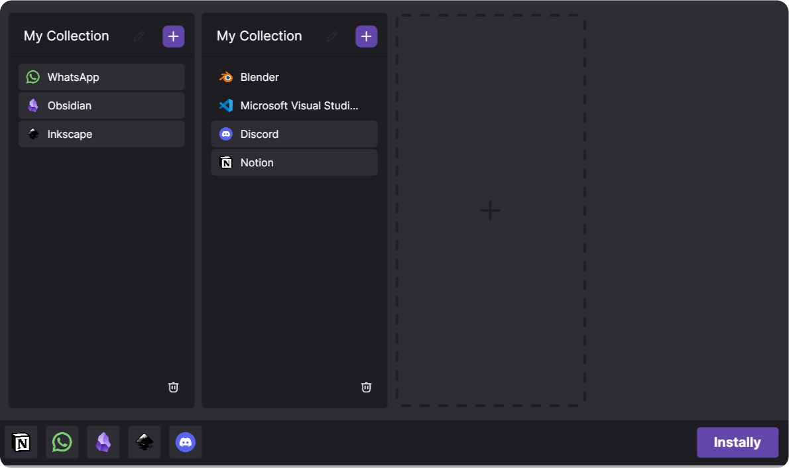
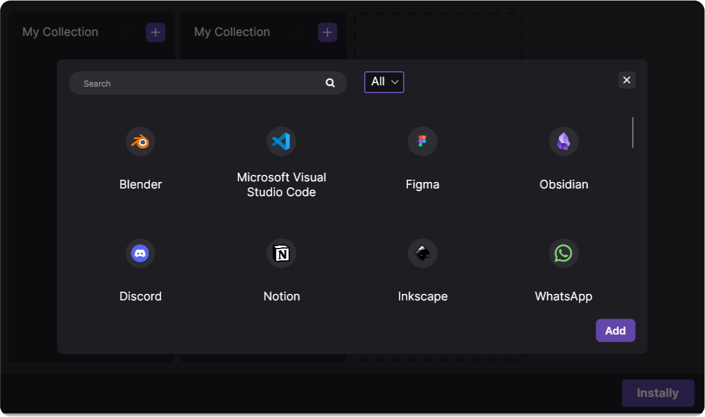

  
  <h1>Instally: A Package Manager Built for WinGet</h1>
   

  
  
  
  

- [About](#about)
- [Features](#features)
- [Future Goals](#future-goals)
- [Contribute](#contribute)
- [License](#license)

## 📖 About

Instally is a GUI interface for WinGet designed to simplify the application installation process. No more browsing multiple websites or dealing with inconsistent download interfaces. Instally centralizes everything, ensuring you always get the latest official versions of the apps you need.

  

## 🛠️ Features

- **Batch Installation**: Install multiple applications simultaneously with one click.
- **Safe and Secure**: Powered by [WinGet](https://github.com/microsoft/winget-cli), backed by Microsoft. 
- **Create your Collections**: Keep your apps organized, and always at hand.
- **Find Your favorite app**: Easily search between more then 4000+ packages available.
- **Ad-Free Interface**: Enjoy a clean, distraction-free experience.

## ✨ Future Goals

- [ ] **User Login**: Save and restore collections across devices effortlessly.
- [ ] **Linux Support**: Multi-platform compatibility for seamless app installation on Linux.
- [ ] **Uninstall Apps**: Be able to quickly uninstall your apps directly from Instally.

**Additional Planned Features:**
- Add the same app to multiple collections.
- Remove apps directly from the search list.
- Drag and drop apps between collections and reorder them.
- Optimized speed and responsiveness.

  

## 📦 Packages

Instally uses [WinGet](https://github.com/microsoft/winget-cli), Microsoft's official package manager, to provide a library of 4,000+ verified applications. Every app is sourced from trusted publishers. Instally is essentially a GUI Interface for WinGet with Unique Features.

## 💜 Contribute

Instally is an indie project and will only be able to continue its development with people's support. If you enjoy using Instally, please consider contributing in one of the following ways:

- Promoting Instally through any channels you can!
- Buying products from my store, [Cozy Dragon](https://www.cozydragon.shop/#!/)
- Making a donation - any amount is highly appreciated! 💜

  

## 📜 License

Instally is licensed under the [GNU General Public License, Version 3](https://www.gnu.org/licenses/gpl-3.0.en.html).

[Back to top](#top)
