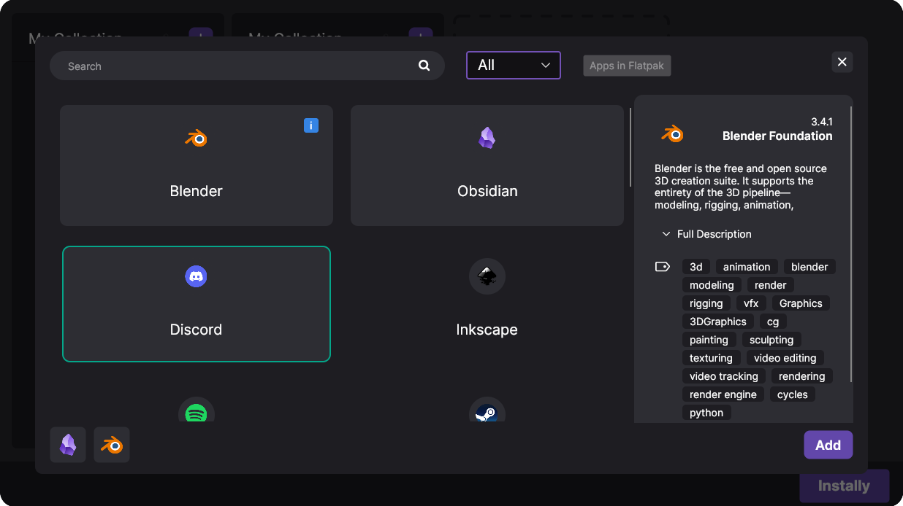
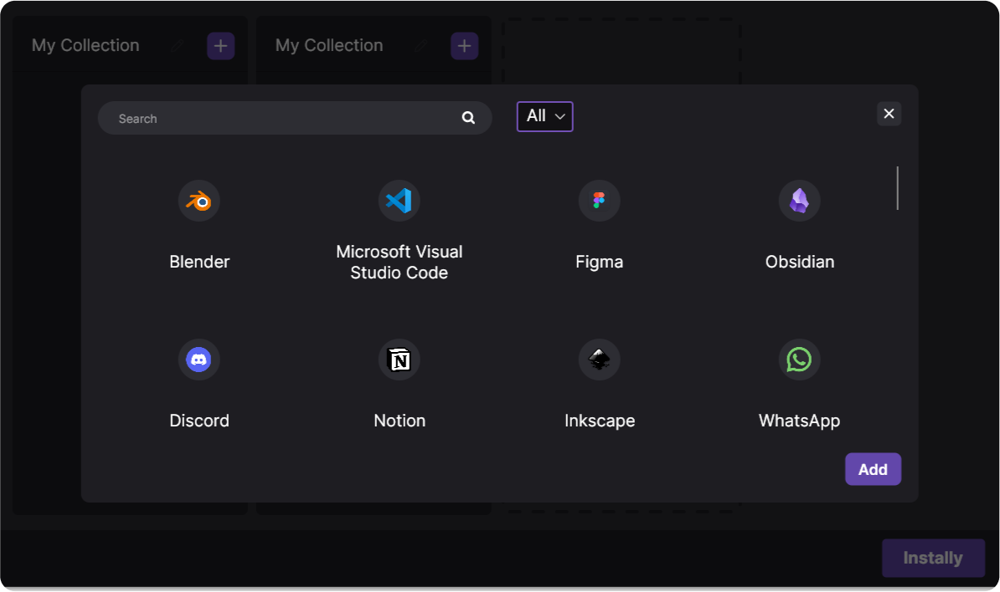
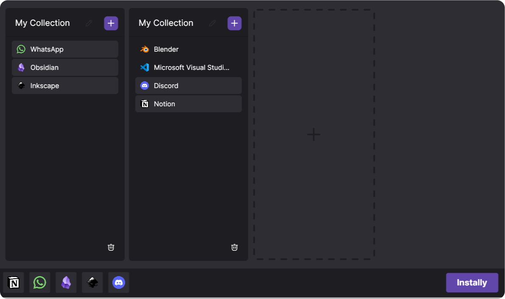

  
  <h1>Instally: A Cross-Platform Package Manager</h1>
   

  
  
  
  
  
  
  

   

## 📖 About

Instally is a GUI interface for package managers such as WinGet and Flatpak, designed to simplify the application installation process. No more browsing multiple websites or dealing with inconsistent download interfaces, Instally centralizes everything, ensuring you always get the latest official versions of the apps you need

  

## 🛠️ Features

- **Batch Installation**: Install multiple applications simultaneously with one click
- **Safe and Secure**: Uses trusted package sources through [WinGet](https://github.com/microsoft/winget-cli) and [Flatpak](https://flatpak.org)
- **Create your Collections**: Keep your apps organized, and always at hand
- **Find Your favorite app**: Easily search between thousands of packages available
- **Ad-Free Interface**: Enjoy a clean, distraction-free experience
- **Cross-Platform**: Install apps using WinGet on Windows and Flatpak on Linux

  

## ✨ Future Goals

- [ ] **User Login**: Save and restore collections across devices effortlessly
- [ ] **Uninstall Apps**: Be able to quickly uninstall your apps directly from Instally

**Additional Planned Features:**
- Add the same app to multiple collections
- The apps added in our [online search](https://instally.app/search) should automatically be added to Instally App when downloaded
- Drag and drop apps between collections and reorder them
- Optimized performance

## 📦 Packages

Applications are sourced directly directly from [WinGet](https://github.com/microsoft/winget-cli), Microsoft's official package manager and [Flatpak](https://flatpak.org), one of the most popular application platforms on Linux, to provide a library of 6,000+ verified applications

  

## 💜 Contribute

This is an indie project and will only be able to continue its development with people's support. If you enjoy using Instally, please consider contributing in one of the following ways:

- Promoting Instally through any channels you can!
- Buying products from my store, [Cozy Dragon](https://www.cozydragon.shop/#!/)
- Making a donation - any amount is highly appreciated! 💜

https://ko-fi.com/stay

## 📜 License

Instally is licensed under the [GNU General Public License, Version 3](https://www.gnu.org/licenses/gpl-3.0.en.html)

[Back to top](#top)
